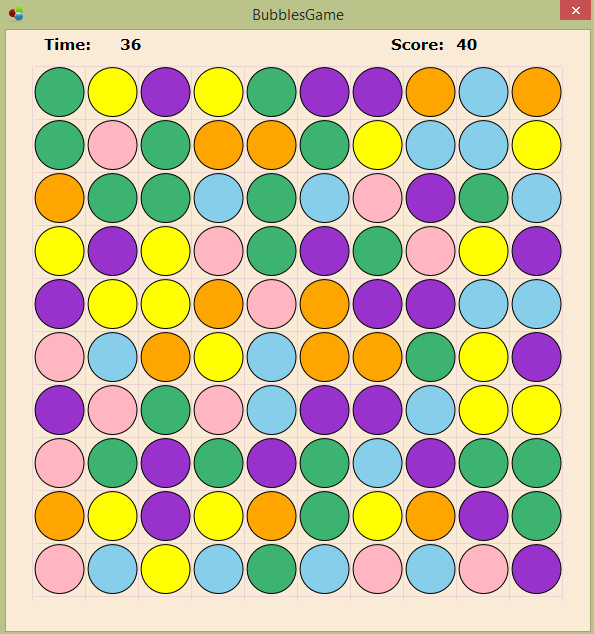
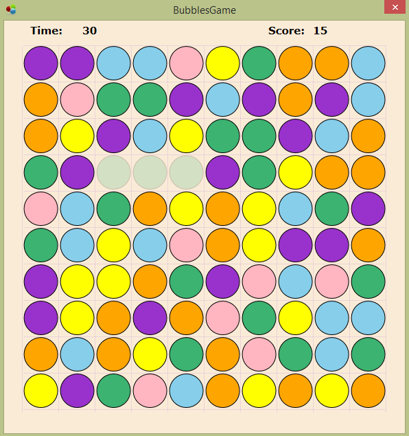

# Bubbles Game
> Desktop game based on the three-in-a-row principle

## Table of contents
* [General info](#general-info)
* [Screenshots](#screenshots)
* [Technologies](#technologies)
* [Contact](#contact)

## General info
Application written by me in 2015 as part of the study of the course of algorithms.
It's a game like wide known Three-in-a row or Jewels, where our task is to find bubbles that can be lined up three in a row.
Using mouse, we can move the bubble to an adjacent position. Three bubbles in a row disappear, the remaining bubbles fall, 
filling their places, new bubbles appear on top. The game has a smooth pleasant animation of moving bubbles, as well as a time countdown and scores.

## Screenshots

## Technologies
* C#
* Windows Presentation Foundation

## Contact
Created by Anton Kozhanov [deal.for at gmail.com]
